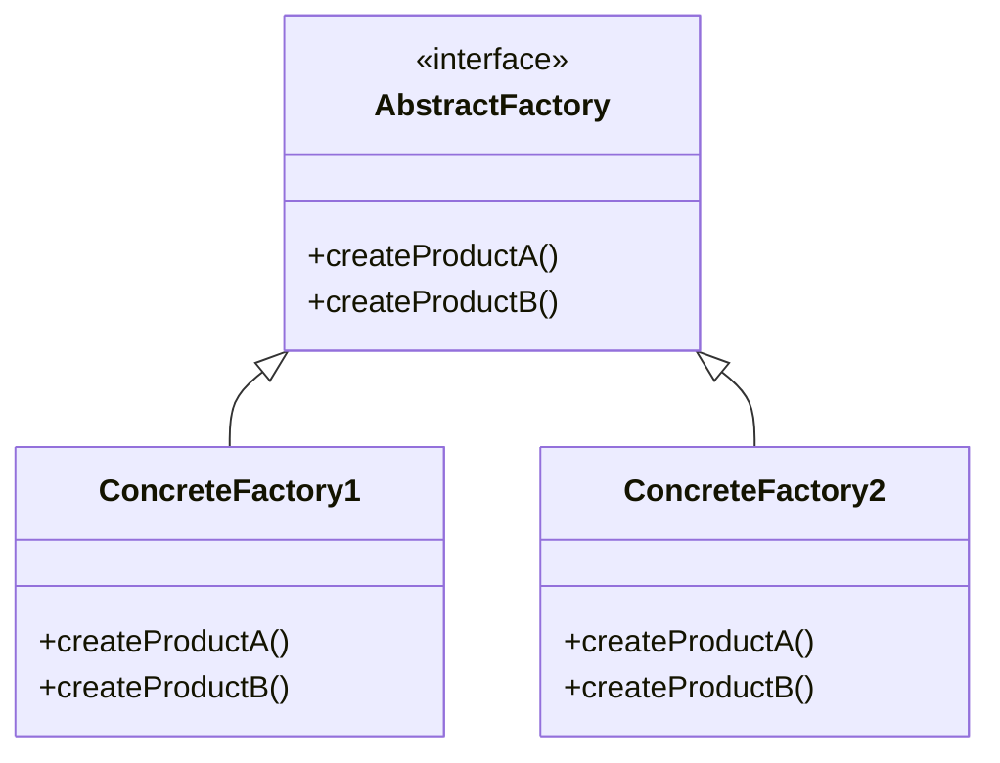
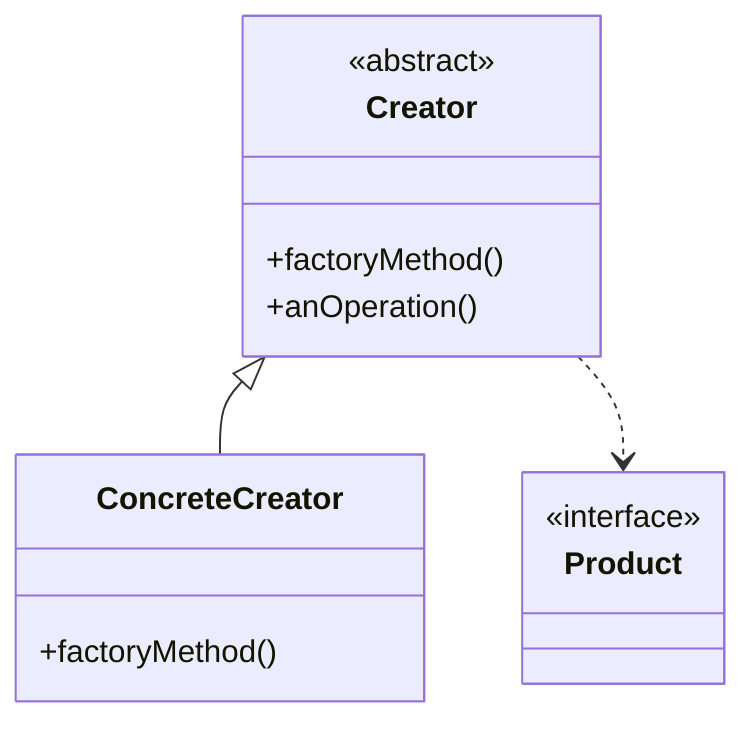
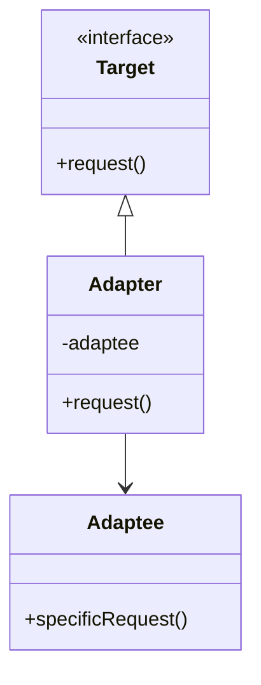
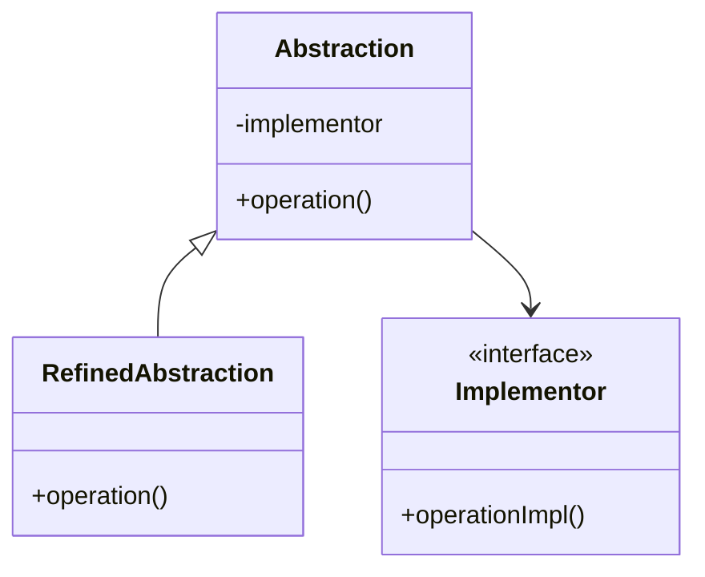
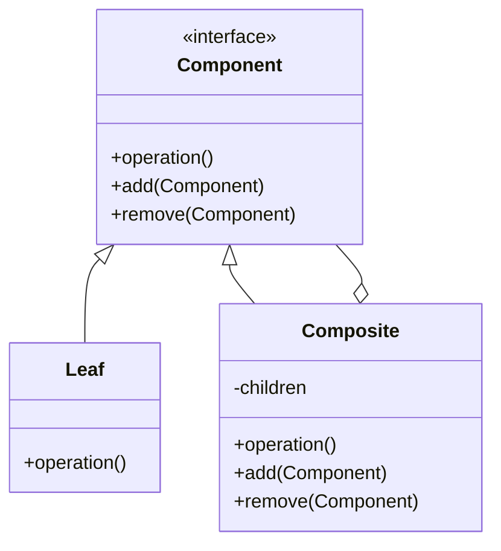
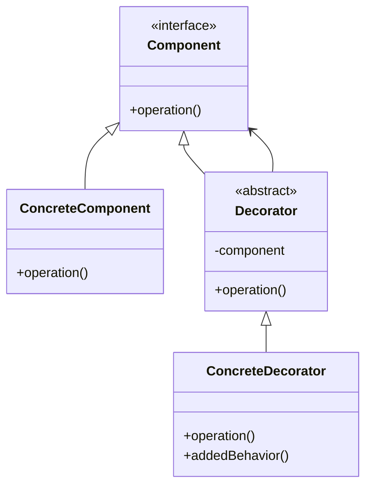
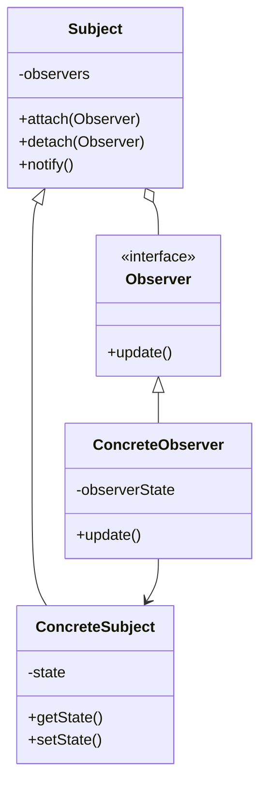
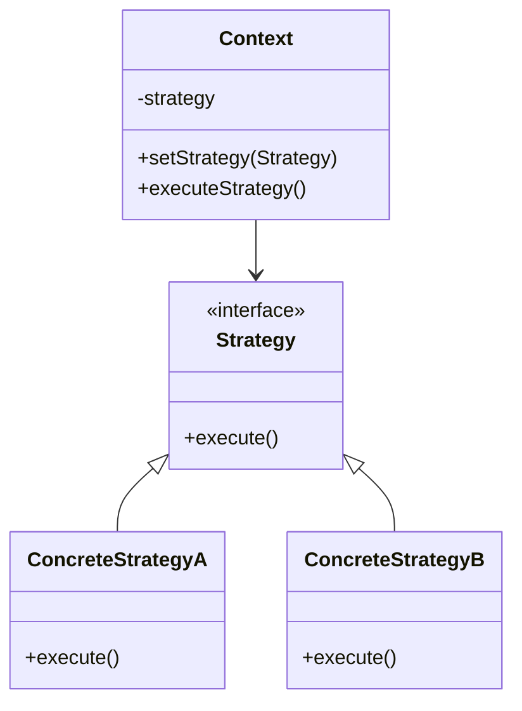

# Design Patterns

Implementations of classic design patterns in C and Java with comprehensive test coverage.

## Test Results

```
All C Tests: PASSED (10/10)
All Java Tests: PASSED (19/19)
All Assertion Tests: PASSED (2/2)
Total: 31/31 PASSED
```

## Prerequisites

- GCC or Clang (for C patterns)
- JDK 11 or later (for Java patterns)
- Make (for build orchestration)

## Usage

```bash
# Run all tests
make test

# Run C tests only
make test-c

# Run Java tests only
make test-java

# Clean build artifacts
make clean
```

## Pattern Catalog

### Creational Patterns

#### Abstract Factory
Creates families of related objects without specifying concrete classes.



**Implementations:** Java, C

#### Factory Method
Define interface for creating objects, let subclasses decide implementation.



**Implementations:** Java, C

#### Builder
Construct complex objects step by step.

**Implementations:** Java

#### Singleton
Ensure a class has only one instance with global access point.

**Implementations:** Java

### Structural Patterns

#### Adapter
Convert interface of a class into another interface clients expect.



**Implementations:** Java, C

#### Bridge
Decouple abstraction from implementation so both can vary independently.



**Implementations:** Java, C

#### Composite
Compose objects into tree structures to represent part-whole hierarchies.



**Implementations:** Java, C

#### Decorator
Attach additional responsibilities to objects dynamically.



**Implementations:** Java, C

#### Facade
Provide unified interface to a set of interfaces in a subsystem.

**Implementations:** Java

### Behavioral Patterns

#### Command
Encapsulate a request as an object to parameterize clients with different requests.

**Implementations:** Java

#### Interpreter
Define grammar representation and interpreter for a language.

**Implementations:** Java

#### Iterator
Access elements of aggregate object sequentially without exposing underlying representation.

**Implementations:** Java

#### Mediator
Define object that encapsulates how a set of objects interact.

**Implementations:** Java

#### Observer
Define one-to-many dependency so when one object changes state, all dependents are notified.



**Implementations:** Java, C

#### State
Allow object to alter its behavior when its internal state changes.

**Implementations:** Java

#### Strategy
Define family of algorithms, encapsulate each one, make them interchangeable.



**Implementations:** Java, C

#### Template Method
Define skeleton of algorithm, deferring some steps to subclasses.

**Implementations:** Java, C

#### Visitor
Represent operation to be performed on elements of an object structure.

**Implementations:** Java

## Project Structure

```
oop_in_java/          # Java pattern implementations
oop_in_c/             # C pattern implementations
tests/                # Test suite
  c/                  # C tests
  java/               # Java tests
Makefile              # Build and test orchestration
```

## Documentation

Each pattern implementation includes:
- Inline documentation with pattern role annotations
- Test cases demonstrating usage
- Both procedural (C) and object-oriented (Java) approaches

## CI/CD

GitHub Actions automatically runs the test suite on every push to master branch.
