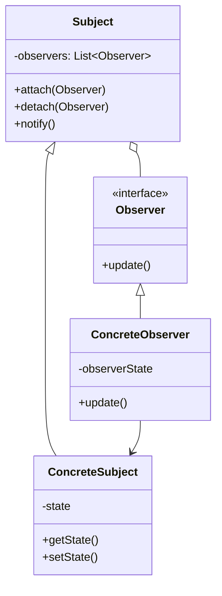

# Observer Pattern

## Intent

Define a one-to-many dependency between objects so that when one object changes state, all its dependents are notified and updated automatically.

## Problem

You need to maintain consistency between related objects without making them tightly coupled. When one object changes, you want multiple other objects to be automatically notified.

## Solution

The Observer pattern defines a subscription mechanism where:
- **Subject** maintains a list of observers
- **Observers** register with the subject
- When subject's state changes, it notifies all observers
- Observers update themselves based on the notification

## Structure



## Implementation

### Java Example

```java
// Observer interface
public interface Observer {
    void update(Observable ob);
}

// Subject interface
public interface Observable {
    void addObserver(Observer ob);
    void deleteObserver(Observer ob);
    void notifyObserver();
}

// Concrete Subject
public class WeatherData implements Observable {
    private ArrayList<Observer> observers;
    private double temperature;
    private double humidity;
    
    public WeatherData() {
        observers = new ArrayList<>();
    }
    
    public void addObserver(Observer ob) {
        observers.add(ob);
    }
    
    public void notifyObserver() {
        for (Observer ob : observers) {
            ob.update(this);
        }
    }
    
    public void measurementsChanged() {
        notifyObserver();
    }
}

// Concrete Observer
public class CurrentConditionDisplay implements Observer {
    private double temperature;
    
    public void update(Observable ob) {
        if (ob instanceof WeatherData) {
            WeatherData weatherData = (WeatherData) ob;
            this.temperature = weatherData.getTemperature();
            display();
        }
    }
    
    public void display() {
        System.out.println("Current temperature: " + temperature);
    }
}
```

### C Example

```c
typedef struct Observer {
    const struct Observer* const this;
    void (*update)(struct Observer* const me, struct Observable* const ob);
} Observer;

typedef struct Observable {
    Observer* lists[MAX];
    int numLists;
    void (*addObserver)(struct Observable* const me, Observer* const ob);
    void (*deleteObserver)(struct Observable* const me, Observer* const ob);
    void (*notifyObserver)(struct Observable* const me);
} Observable;

typedef struct WeatherData {
    const Observable* super;
    Observer* lists[MAX];
    int numLists;
    double temperature;
    double humidity;
} WeatherData;
```

## Use Cases

- **Event handling systems**: GUI components, button clicks, keyboard events
- **Model-View-Controller (MVC)**: Model notifies views when data changes
- **Publish-subscribe systems**: Message brokers, event buses
- **Real-time data updates**: Stock tickers, weather stations, sensor networks
- **Logging and monitoring**: Multiple loggers observing system events

## Participants

- **Subject**: Interface for attaching/detaching observers and notifying them
- **ConcreteSubject**: Stores state of interest, sends notifications when state changes
- **Observer**: Interface defining update operation for objects that should be notified
- **ConcreteObserver**: Maintains reference to ConcreteSubject, implements update to stay consistent

## Consequences

**Benefits:**
- Loose coupling between subject and observers
- Support for broadcast communication
- Dynamic relationships (observers can be added/removed at runtime)

**Drawbacks:**
- Unexpected updates (observers don't know about each other)
- Memory leaks if observers aren't properly detached
- Update overhead for many observers

## Related Patterns

- **Mediator**: Encapsulates complex updates between colleagues; Observer distributes communication
- **Singleton**: Subject is often implemented as a singleton
- **Chain of Responsibility**: Can be used with Observer for event propagation

## Implementation Notes

- Consider using weak references to avoid memory leaks
- Be careful with update cycles (observer updating subject which notifies observer again)
- For performance, consider batching notifications
- Thread safety is important in concurrent environments

## See Also

- Implementation: `/oop_in_java/Observer/`
- Implementation: `/oop_in_c/Observer/`
- Tests: `/tests/java/TestObserver.java`, `/tests/c/TestObserver.c`
