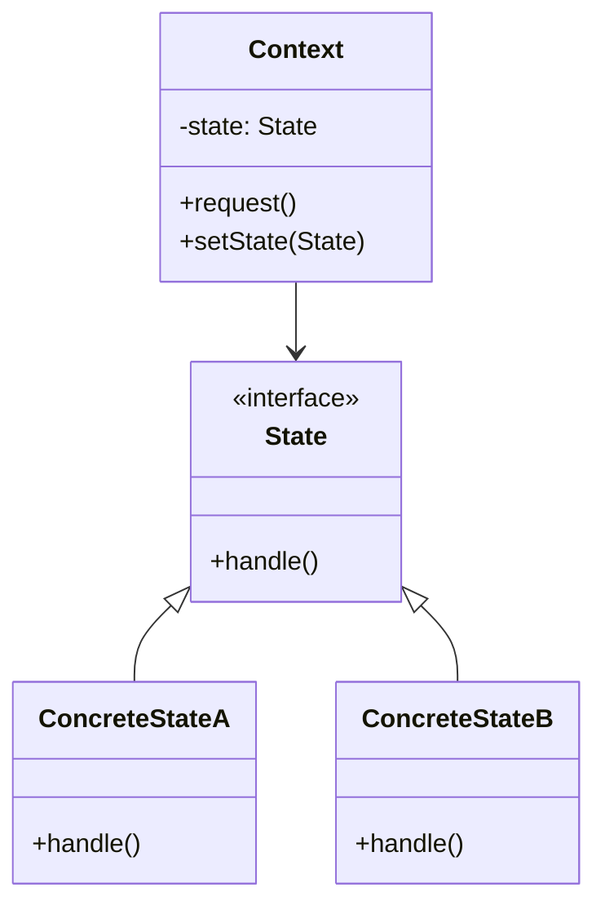

# State Pattern

## Intent

Allow an object to alter its behavior when its internal state changes. The object will appear to change its class.

## Real-World Analogy

Imagine your smartphone. It behaves differently depending on its state:
1. **Unlocked**: Tapping screen launches apps.
2. **Locked**: Tapping screen asks for a password.
3. **Low Battery**: Tapping might show "Battery Low" popup or screen might be dim.

The phone is the same object, but its behavior changes completely based on its current state. If you used a giant `switch` statement inside the `touch()` method (`case LOCKED: ... case UNLOCKED: ...`), it would become a nightmare as you add more states (e.g., "Do Not Disturb", "Airplane Mode"). The State pattern suggests creating separate classes for each state.

## Solution

Encapsulate state-specific behavior in separate state classes. The context delegates requests to the current state object.

## Structure



## Implementation

### Java Example

```java
// State interface
public interface State {
    void insertQuarter();
    void ejectQuarter();
    void turnCrank();
    void dispense();
}

// Concrete State
public class NoQuarterState implements State {
    GumballMachine gumballMachine;
    
    public NoQuarterState(GumballMachine gumballMachine) {
        this.gumballMachine = gumballMachine;
    }
    
    public void insertQuarter() {
        System.out.println("You inserted a quarter");
        gumballMachine.setState(gumballMachine.getHasQuarterState());
    }
    
    public void ejectQuarter() {
        System.out.println("You haven't inserted a quarter");
    }
    
    public void turnCrank() {
        System.out.println("You turned, but there's no quarter");
    }
    
    public void dispense() {
        System.out.println("You need to pay first");
    }
}

// Context
public class GumballMachine {
    State soldOutState;
    State noQuarterState;
    State hasQuarterState;
    State soldState;
    
    State state;
    int count = 0;
    
    public GumballMachine(int numberGumballs) {
        soldOutState = new SoldOutState(this);
        noQuarterState = new NoQuarterState(this);
        hasQuarterState = new HasQuarterState(this);
        soldState = new SoldState(this);
        
        this.count = numberGumballs;
        if (numberGumballs > 0) {
            state = noQuarterState;
        } else {
            state = soldOutState;
        }
    }
    
    public void insertQuarter() {
        state.insertQuarter();
    }
}
```

## Use Cases

- **Workflow systems**: Different states in approval process
- **Network connections**: Connected, disconnected, connecting states
- **Document editors**: Edit mode, read-only mode, review mode
- **Game characters**: Alive, dead, invincible states
- **Order processing**: New, paid, shipped, delivered states

## Participants

- **Context**: Maintains instance of ConcreteState subclass
- **State**: Defines interface for state-specific behavior
- **ConcreteState**: Implements behavior associated with a state of Context

## Consequences

**Benefits:**
- Eliminates large conditional statements
- Each state is encapsulated in its own class
- Easy to add new states
- Makes state transitions explicit

**Drawbacks:**
- Increases number of classes
- Can be overkill for simple state machines

## Related Patterns

- **Strategy**: Behavior selection; State transitions are automatic
- **Flyweight**: Can be used to share State objects

## See Also

- Implementation: `/oop_in_java/state/`
- Tests: `/tests/java/TestState.java`
