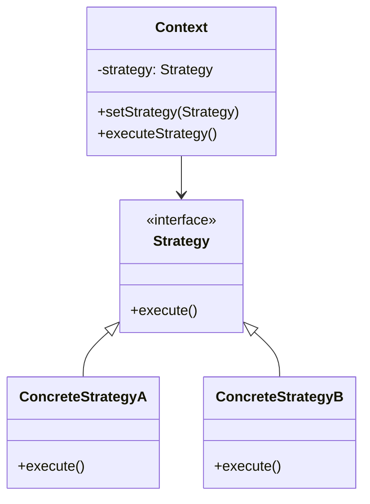

# Strategy Pattern

## Intent

Define a family of algorithms, encapsulate each one, and make them interchangeable. Strategy lets the algorithm vary independently from clients that use it.

## Real-World Analogy

You need to get to the airport. You can pick one of several strategies:
1. **Bicycle**: Free, fun, but slow and sweaty.
2. **Bus**: Cheap, but slow and depends on schedule.
3. **Taxi**: Fast and comfortable, but expensive.
4. **Helicopter**: Super fast, super expensive.

You (the Context) choose a strategy based on your constraints (budget, time). You don't need to change your "Traveler" class to add a new transportation method. You just plug in a new strategy. The result (getting to the airport) is the same, but the method varies.

## Solution

Define a family of algorithms as separate classes with a common interface. The client can choose which algorithm to use by composition rather than inheritance.

## Structure



## Implementation

### Java Example

```java
// Strategy interface
public interface FlyBehavior {
    void fly();
}

// Concrete Strategies
public class FlyWithWings implements FlyBehavior {
    public void fly() {
        System.out.println("Flying with wings!");
    }
}

public class FlyNoWay implements FlyBehavior {
    public void fly() {
        System.out.println("Can't fly");
    }
}

// Context
public class Duck {
    private FlyBehavior flyBehavior;
    
    public void setFlyBehavior(FlyBehavior fb) {
        flyBehavior = fb;
    }
    
    public void performFly() {
        flyBehavior.fly();
    }
}

// Usage
Duck mallard = new Duck();
mallard.setFlyBehavior(new FlyWithWings());
mallard.performFly();  // Flying with wings!

mallard.setFlyBehavior(new FlyNoWay());
mallard.performFly();  // Can't fly
```

### C Example

```c
typedef struct FlyBehavior {
    void (*fly)(void);
} FlyBehavior;

typedef struct Duck {
    FlyBehavior* flyBehavior;
} Duck;

void FlyWithWings_fly(void) {
    printf("Flying with wings!\n");
}

void Duck_performFly(Duck* duck) {
    duck->flyBehavior->fly();
}
```

## Use Cases

- **Sorting algorithms**: Choose QuickSort, MergeSort, BubbleSort based on data size
- **Compression**: Different compression algorithms (ZIP, RAR, GZIP)
- **Payment methods**: Credit card, PayPal, Bitcoin
- **Navigation**: Different route calculation strategies (shortest, fastest, scenic)
- **Validation**: Different validation rules based on context

## Participants

- **Strategy**: Declares common interface for all supported algorithms
- **ConcreteStrategy**: Implements the algorithm using the Strategy interface
- **Context**: Maintains reference to Strategy object, configured with ConcreteStrategy

## Consequences

**Benefits:**
- Eliminates conditional statements
- Encapsulates algorithm implementation details
- Algorithms can be switched at runtime
- Easy to add new strategies

**Drawbacks:**
- Clients must be aware of different strategies
- Increases number of objects
- Communication overhead between Strategy and Context

## Related Patterns

- **State**: Strategy changes behavior; State represents different states
- **Decorator**: Changes object's skin; Strategy changes guts
- **Template Method**: Uses inheritance; Strategy uses composition

## See Also

- Implementation: `/oop_in_java/Strategy/`
- Implementation: `/oop_in_c/Strategy/`
- Tests: `/tests/java/TestStrategy.java`, `/tests/c/TestStrategy.c`
