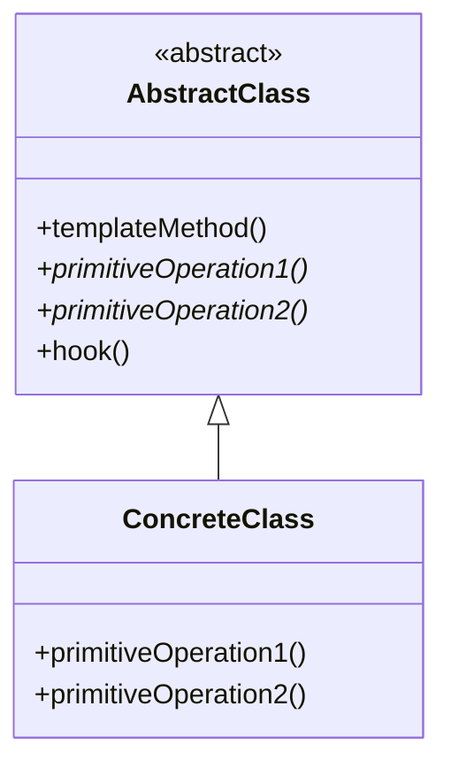

# Template Method Pattern

## Intent

Define the skeleton of an algorithm in an operation, deferring some steps to subclasses. Template Method lets subclasses redefine certain steps of an algorithm without changing the algorithm's structure.

## Problem

Multiple classes have similar algorithms that differ only in some steps.

## Solution

Create an abstract class with a template method that defines the algorithm skeleton. Subclasses override specific steps without changing the overall structure.

## Structure



## Implementation

### Java Example

```java
// Abstract Class
public abstract class CaffeineBeverage {
    // Template method
    final void prepareRecipe() {
        boilWater();
        brew();
        pourInCup();
        addCondiments();
    }
    
    abstract void brew();
    abstract void addCondiments();
    
    void boilWater() {
        System.out.println("Boiling water");
    }
    
    void pourInCup() {
        System.out.println("Pouring into cup");
    }
}

// Concrete Class
public class Coffee extends CaffeineBeverage {
    void brew() {
        System.out.println("Dripping coffee through filter");
    }
    
    void addCondiments() {
        System.out.println("Adding sugar and milk");
    }
}

public class Tea extends CaffeineBeverage {
    void brew() {
        System.out.println("Steeping the tea");
    }
    
    void addCondiments() {
        System.out.println("Adding lemon");
    }
}
```

### C Example

```c
typedef struct Beverage {
    void (*brew)(struct Beverage* me);
    void (*addCondiments)(struct Beverage* me);
} Beverage;

void Beverage_prepareRecipe(Beverage* me) {
    printf("Boiling water\n");
    me->brew(me);
    printf("Pouring into cup\n");
    me->addCondiments(me);
}
```

## Use Cases

- **Framework extension points**: Allow customization of specific steps
- **Data processing pipelines**: ETL with customizable transformations
- **Testing frameworks**: Setup, execute, teardown pattern
- **Document generation**: Different formats with same structure

## Participants

- **AbstractClass**: Defines template method and abstract primitive operations
- **ConcreteClass**: Implements primitive operations

## Consequences

**Benefits:**
- Code reuse for invariant parts
- Controls extension points (hooks)
- Inversion of control (Hollywood Principle)

**Drawbacks:**
- Requires subclassing
- Can be difficult to understand flow

## See Also

- Implementation: `/oop_in_java/Template/`
- Implementation: `/oop_in_c/Template/`
