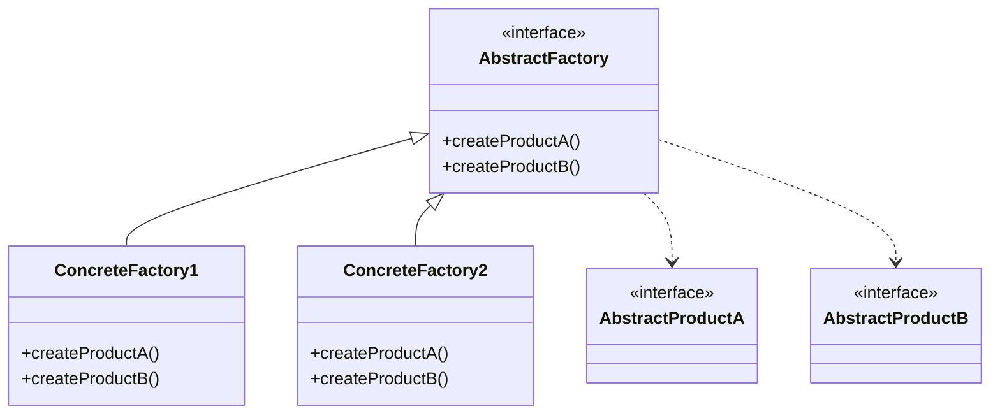

# Abstract Factory Pattern

## Intent

Provide an interface for creating families of related or dependent objects without specifying their concrete classes.

## Real-World Analogy

Imagine a furniture shop simulator. Your code consists of classes that represent:
1. A family of related products, say: `Chair` + `Sofa` + `CoffeeTable`.
2. Several variants of this family. For example, products `Chair` + `Sofa` + `CoffeeTable` are available in these variants: `Modern`, `Victorian`, `ArtDeco`.

You need a way to create individual furniture objects so that they match other objects of the same family. Customers get quite mad when they receive a non-matching furniture like a Victorian chair in a Modern room.

Also, you don't want to change existing code when adding new products or families of products. Furniture vendors update their catalogs very often, and you wouldn't want to change the core code each time.

## Solution

Define an abstract factory interface with methods for creating each product type. Concrete factories implement these methods to create compatible product families.

## Structure



## Implementation

### Java Example

```java
// Abstract Products
public interface Button {
    void paint();
}

public interface Checkbox {
    void paint();
}

// Concrete Products - Windows
public class WinButton implements Button {
    public void paint() {
        System.out.println("Windows button");
    }
}

public class WinCheckbox implements Checkbox {
    public void paint() {
        System.out.println("Windows checkbox");
    }
}

// Concrete Products - Mac
public class MacButton implements Button {
    public void paint() {
        System.out.println("Mac button");
    }
}

// Abstract Factory
public interface GUIFactory {
    Button createButton();
    Checkbox createCheckbox();
}

// Concrete Factories
public class WinFactory implements GUIFactory {
    public Button createButton() {
        return new WinButton();
    }
    
    public Checkbox createCheckbox() {
        return new WinCheckbox();
    }
}

public class MacFactory implements GUIFactory {
    public Button createButton() {
        return new MacButton();
    }
    
    public Checkbox createCheckbox() {
        return new MacCheckbox();
    }
}
```

### C Example

```c
typedef struct Button {
    void (*paint)(struct Button* me);
} Button;

typedef struct GUIFactory {
    Button* (*createButton)(void);
    Checkbox* (*createCheckbox)(void);
} GUIFactory;
```

## Use Cases

- **UI toolkits**: Platform-specific widgets (Windows, Mac, Linux)
- **Theme systems**: Different visual themes with consistent components
- **Database access**: Different database families (MySQL, PostgreSQL)

## See Also

- Implementation: `/oop_in_java/AbstractFactory/`
- Implementation: `/oop_in_c/AbstractFactory/`
