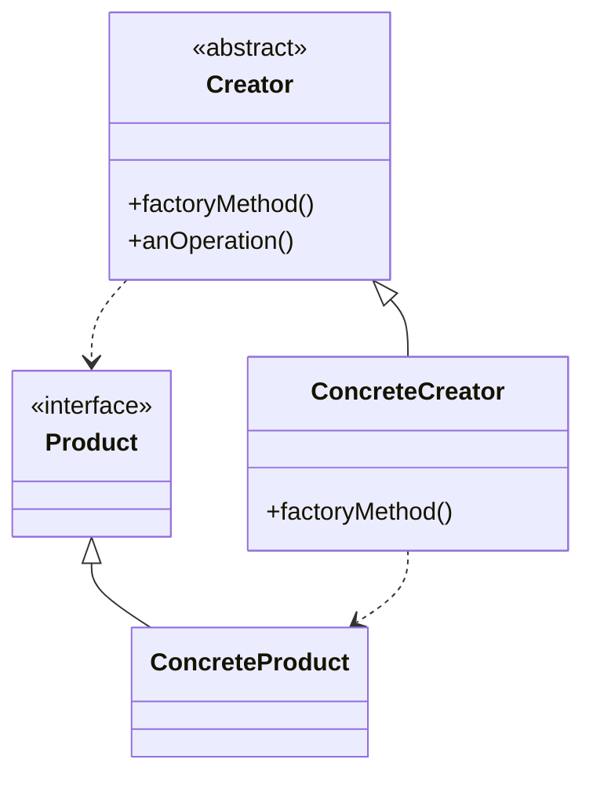

# Factory Method Pattern

## Intent

Define an interface for creating an object, but let subclasses decide which class to instantiate. Factory Method lets a class defer instantiation to subclasses.

## Real-World Analogy

Imagine you're creating a logistics management application. The first version of your app can only handle transportation by trucks, so the bulk of your code lives inside the `Truck` class.

After a while, your app becomes pretty popular. Each day you receive dozens of requests from sea transportation lovers. "Great news, right?" But how about the code? At present, most of your code is coupled to the `Truck` class. Adding `Ships` into the app would require making changes to the entire codebase. Moreover, if later you decide to add another type of transportation to the app, you will probably need to make all of these changes again.

As a result, you will end up with a nasty code, riddled with conditionals that switch the app's behavior depending on the class of transportation objects.

## Solution

Define an abstract creator class with a factory method that returns a product. Concrete creator subclasses override the factory method to create specific product types.

## Structure



## Implementation

### Java Example

```java
// Product
public abstract class Pizza {
    String name;
    
    void prepare() {
        System.out.println("Preparing " + name);
    }
    
    void bake() {
        System.out.println("Baking " + name);
    }
    
    void cut() {
        System.out.println("Cutting " + name);
    }
}

// Concrete Products
public class NYStyleCheesePizza extends Pizza {
    public NYStyleCheesePizza() {
        name = "NY Style Sauce and Cheese Pizza";
    }
}

public class ChicagoStyleCheesePizza extends Pizza {
    public ChicagoStyleCheesePizza() {
        name = "Chicago Style Deep Dish Cheese Pizza";
    }
}

// Creator
public abstract class PizzaStore {
    public Pizza orderPizza(String type) {
        Pizza pizza = createPizza(type);  // Factory method
        pizza.prepare();
        pizza.bake();
        pizza.cut();
        return pizza;
    }
    
    // Factory method
    protected abstract Pizza createPizza(String type);
}

// Concrete Creators
public class NYPizzaStore extends PizzaStore {
    protected Pizza createPizza(String type) {
        if (type.equals("cheese")) {
            return new NYStyleCheesePizza();
        }
        return null;
    }
}

public class ChicagoPizzaStore extends PizzaStore {
    protected Pizza createPizza(String type) {
        if (type.equals("cheese")) {
            return new ChicagoStyleCheesePizza();
        }
        return null;
    }
}

// Usage
PizzaStore nyStore = new NYPizzaStore();
Pizza pizza = nyStore.orderPizza("cheese");
```

### C Example

```c
typedef struct Pizza {
    const struct Pizza* super;
    char* name;
    void (*prepare)(struct Pizza* const me);
    void (*bake)(struct Pizza* const me);
} Pizza;

typedef struct PizzaStore {
    Pizza* (*createPizza)(struct PizzaStore* const me, const char* type);
    Pizza* (*orderPizza)(struct PizzaStore* const me, const char* type);
} PizzaStore;

typedef struct NYPizzaStore {
    const PizzaStore* super;
} NYPizzaStore;

Pizza* NYPizzaStore_createPizza(PizzaStore* const me, const char* type) {
    if (strcmp(type, "cheese") == 0) {
        return NYStyleCheesePizza_new();
    }
    return NULL;
}
```

## Use Cases

- **Framework classes**: Creating framework objects that are customized by applications
- **Document creation**: Creating different document types (Word, PDF, HTML)
- **UI toolkits**: Creating platform-specific UI components
- **Game development**: Creating different enemy types, weapons, levels
- **Parsers**: Creating different parser instances based on file type

## Participants

- **Product**: Defines interface of objects the factory method creates
- **ConcreteProduct**: Implements the Product interface
- **Creator**: Declares factory method, may provide default implementation
- **ConcreteCreator**: Overrides factory method to return ConcreteProduct instance

## Consequences

**Benefits:**
- Eliminates need to bind application-specific classes into code
- Provides hooks for subclasses to customize object creation
- Connects parallel class hierarchies

**Drawbacks:**
- Clients might need to subclass Creator just to create particular ConcreteProduct
- Can result in many small classes

## Related Patterns

- **Abstract Factory**: Often implemented using Factory Methods
- **Template Method**: Factory Methods are often called within Template Methods
- **Prototype**: Doesn't require subclassing, but requires initialization; Factory Method requires subclassing but doesn't require initialization

## Implementation Notes

- Creator can provide a default implementation of factory method
- Use parameters to create different products from a single factory method
- Consider using reflection or configuration to avoid excessive subclassing
- Factory method can return existing objects instead of always creating new ones

## See Also

- Implementation: `/oop_in_java/Factorymethod/`
- Implementation: `/oop_in_c/FactoryMethod/`
- Tests: `/tests/java/TestFactorymethod.java`, `/tests/c/TestFactoryMethod.c`
