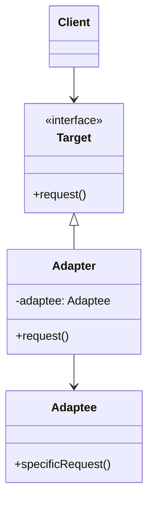

# Adapter Pattern

## Intent

Convert the interface of a class into another interface clients expect. Adapter lets classes work together that couldn't otherwise because of incompatible interfaces.

## Problem

You want to use an existing class but its interface doesn't match the one you need.

## Solution

Create an adapter class that wraps the existing class and translates requests from the target interface to the adaptee's interface.

## Structure



## Implementation

### Java Example

```java
// Target interface
public interface Duck {
    void quack();
    void fly();
}

// Adaptee
public class Turkey {
    public void gobble() {
        System.out.println("Gobble gobble");
    }
    
    public void fly() {
        System.out.println("Flying short distance");
    }
}

// Adapter
public class TurkeyAdapter implements Duck {
    Turkey turkey;
    
    public TurkeyAdapter(Turkey turkey) {
        this.turkey = turkey;
    }
    
    public void quack() {
        turkey.gobble();  // Translate quack to gobble
    }
    
    public void fly() {
        for (int i = 0; i < 5; i++) {
            turkey.fly();  // Turkeys fly short distances
        }
    }
}

// Usage
Turkey turkey = new Turkey();
Duck turkeyAdapter = new TurkeyAdapter(turkey);
turkeyAdapter.quack();  // Gobble gobble
```

### C Example

```c
typedef struct Duck {
    void (*quack)(struct Duck* me);
    void (*fly)(struct Duck* me);
} Duck;

typedef struct Turkey {
    void (*gobble)(struct Turkey* me);
    void (*fly)(struct Turkey* me);
} Turkey;

typedef struct TurkeyAdapter {
    Duck super;
    Turkey* turkey;
} TurkeyAdapter;

void TurkeyAdapter_quack(Duck* me) {
    TurkeyAdapter* adapter = (TurkeyAdapter*)me;
    adapter->turkey->gobble(adapter->turkey);
}
```

## Use Cases

- **Legacy code integration**: Adapt old interfaces to new systems
- **Third-party libraries**: Make incompatible libraries work with your code
- **Database adapters**: Uniform interface for different database systems
- **Hardware abstraction**: Abstract different hardware interfaces
- **File format conversion**: Read different file formats through common interface

## Participants

- **Target**: Defines domain-specific interface that Client uses
- **Adapter**: Adapts interface of Adaptee to Target interface
- **Adaptee**: Defines existing interface that needs adapting
- **Client**: Collaborates with objects conforming to Target interface

## Consequences

**Benefits:**
- Allows reuse of existing functionality
- Decouples client from implementation details
- Single Responsibility Principle - separate interface conversion

**Drawbacks:**
- Increases overall complexity
- Sometimes simpler to just change the source code
- May impact performance due to indirection

## Related Patterns

- **Bridge**: Similar structure but different intent; Bridge designed upfront
- **Decorator**: Adds responsibilities; Adapter changes interface
- **Proxy**: Same interface; Adapter provides different interface

## See Also

- Implementation: `/oop_in_java/Adapter/`
- Implementation: `/oop_in_c/Adapter/`
- Tests: `/tests/java/TestAdapter.java`, `/tests/c/TestAdapter.c`
