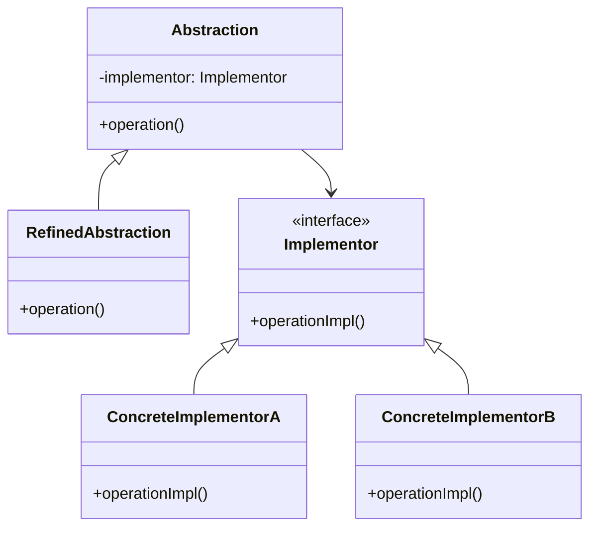

# Bridge Pattern

## Intent

Decouple an abstraction from its implementation so that the two can vary independently.

## Real-World Analogy

Imagine the `RemoteControl` and `Device` (TV, Radio) relationship. You have a `Remote` class and a `Device` class.
If you simply extend `Remote` to creating `SonyRemote` and `SamsungRemote`, and then you want to add `AdvancedRemote` (with voice control), you'd need `SonyAdvancedRemote` and `SamsungAdvancedRemote`. The hierarchy grows exponentially (Cartesian product).

The Bridge pattern suggests splitting this into two hierarchies:
1. **Abstraction**: The Remote Control (Universal Remote, Basic Remote, Advanced Remote).
2. **Implementation**: The Device (Sony TV, Samsung TV).

Now you can develop new Remotes without touching the Device classes, and add new Devices without changing the Remote code. A universal remote can work with any brand of TV.

## Solution

Separate the abstraction and implementation into separate class hierarchies connected by composition.

## Structure



## Implementation

### Java Example

```java
// Implementor interface
public interface TV {
    void on();
    void off();
    void tuneChannel(int channel);
}

// Concrete Implementors
public class SonyTV implements TV {
    public void on() {
        System.out.println("Sony TV: ON");
    }
    
    public void off() {
        System.out.println("Sony TV: OFF");
    }
    
    public void tuneChannel(int channel) {
        System.out.println("Sony TV: Channel " + channel);
    }
}

// Abstraction
public abstract class RemoteControl {
    protected TV tv;
    
    public RemoteControl(TV tv) {
        this.tv = tv;
    }
    
    public abstract void on();
    public abstract void off();
    public abstract void setChannel(int channel);
}

// Refined Abstraction
public class ConcreteRemote extends RemoteControl {
    public ConcreteRemote(TV tv) {
        super(tv);
    }
    
    public void on() {
        tv.on();
    }
    
    public void off() {
        tv.off();
    }
    
    public void setChannel(int channel) {
        tv.tuneChannel(channel);
    }
}
```

### C Example

```c
typedef struct TV {
    void (*on)(struct TV* me);
    void (*off)(struct TV* me);
} TV;

typedef struct RemoteControl {
    TV* tv;
    void (*powerOn)(struct RemoteControl* me);
} RemoteControl;
```

## Use Cases

- **GUI frameworks**: Separate window abstraction from platform implementation
- **Device drivers**: Abstract device operations from hardware specifics
- **Database access**: Separate query interface from database implementation

## See Also

- Implementation: `/oop_in_java/Bridge/`
- Implementation: `/oop_in_c/Bridge/`
