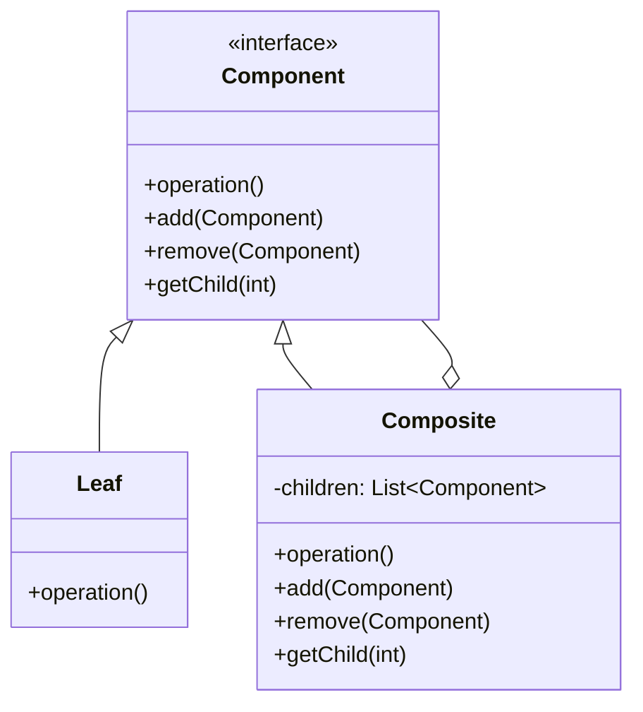

# Composite Pattern

## Intent

Compose objects into tree structures to represent part-whole hierarchies. Composite lets clients treat individual objects and compositions uniformly.

## Real-World Analogy

Imagine a delivery service. You can ship a simple product (like a Hammer) or a Box. A Box can contain products and smaller Boxes.
If you want to calculate the total price of a shipment, you can't just iterate a simple list. You have to open every box, and if there's a box inside, you open that too, recursively.

Ideally, you want to treat a "Box" and a "Hammer" uniformly. You should be able to ask `getPrice()` on any item. If it's a hammer, it returns its price. If it's a box, it asks every item inside for its price and returns the sum. You (the client) don't care if it's a simple item or a complex box of boxes.

## Solution

Create a component interface that defines operations for both leaf and composite objects. Composite objects contain collections of components.

## Structure



## Implementation

### Java Example

```java
// Component
public abstract class MenuComponent {
    public void add(MenuComponent menuComponent) {
        throw new UnsupportedOperationException();
    }
    
    public void remove(MenuComponent menuComponent) {
        throw new UnsupportedOperationException();
    }
    
    public MenuComponent getChild(int i) {
        throw new UnsupportedOperationException();
    }
    
    public String getName() {
        throw new UnsupportedOperationException();
    }
    
    public void print() {
        throw new UnsupportedOperationException();
    }
}

// Leaf
public class MenuItem extends MenuComponent {
    String name;
    double price;
    
    public MenuItem(String name, double price) {
        this.name = name;
        this.price = price;
    }
    
    public String getName() {
        return name;
    }
    
    public void print() {
        System.out.println("  " + getName() + ", $" + price);
    }
}

// Composite
public class Menu extends MenuComponent {
    ArrayList<MenuComponent> menuComponents = new ArrayList<>();
    String name;
    
    public Menu(String name) {
        this.name = name;
    }
    
    public void add(MenuComponent menuComponent) {
        menuComponents.add(menuComponent);
    }
    
    public void remove(MenuComponent menuComponent) {
        menuComponents.remove(menuComponent);
    }
    
    public void print() {
        System.out.println("\n" + getName());
        for (MenuComponent menuComponent : menuComponents) {
            menuComponent.print();
        }
    }
}
```

### C Example

```c
typedef struct Component {
    void (*operation)(struct Component* me);
    void (*add)(struct Component* me, struct Component* child);
} Component;

typedef struct Leaf {
    Component super;
    char* name;
} Leaf;

typedef struct Composite {
    Component super;
    Component* children[MAX_CHILDREN];
    int childCount;
} Composite;

void Composite_operation(Component* me) {
    Composite* composite = (Composite*)me;
    for (int i = 0; i < composite->childCount; i++) {
        composite->children[i]->operation(composite->children[i]);
    }
}
```

## Use Cases

- **File systems**: Files and directories
- **GUI components**: Containers and widgets
- **Organization structures**: Companies, departments, employees
- **Document structures**: Sections, paragraphs, characters
- **Graphics drawing**: Groups of shapes

## Participants

- **Component**: Declares interface for objects in composition
- **Leaf**: Represents leaf objects with no children
- **Composite**: Stores child components, implements child-related operations
- **Client**: Manipulates objects through Component interface

## Consequences

**Benefits:**
- Simplifies client code (uniform treatment)
- Makes it easy to add new component types
- Flexible tree structures

**Drawbacks:**
- Can make design overly general
- Hard to restrict component types in composite

## Related Patterns

- **Decorator**: Similar structure but different intent; Decorator adds responsibilities
- **Iterator**: Often used to traverse Composite structures
- **Visitor**: Can apply operations over Composite structures

## See Also

- Implementation: `/oop_in_java/Composite/`
- Implementation: `/oop_in_c/Composite/`
- Tests: `/tests/java/TestComposite.java`, `/tests/c/TestComposite.c`
