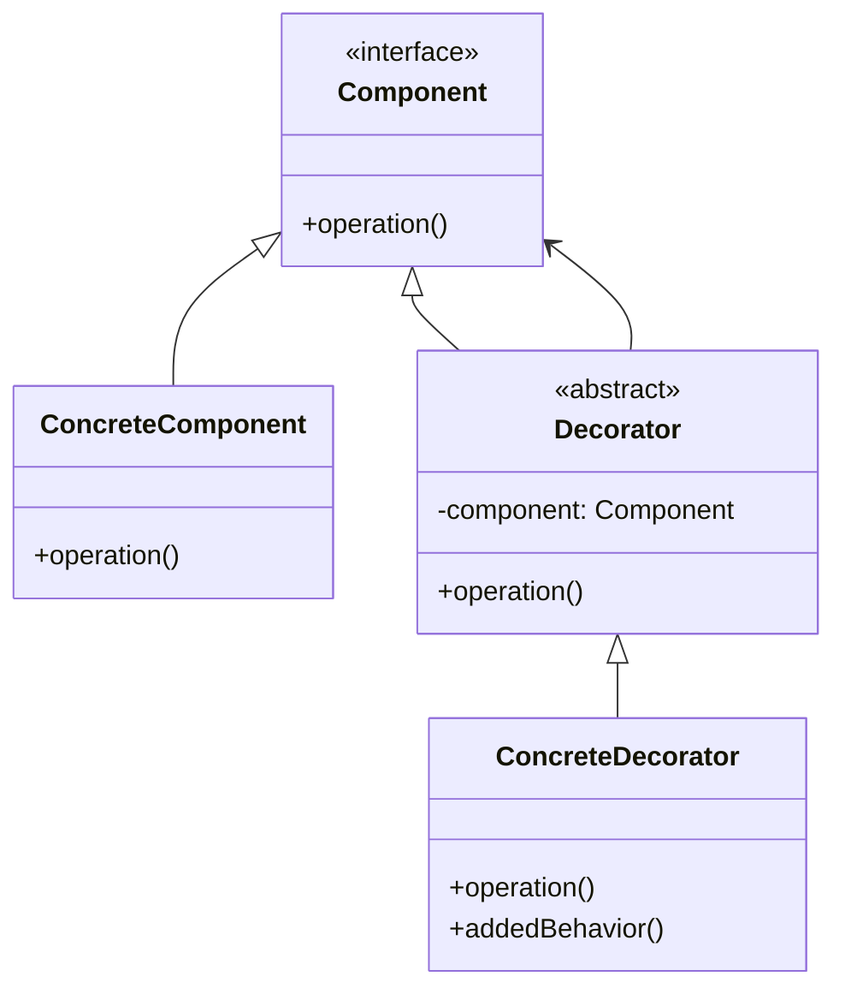

# Decorator Pattern

## Intent

Attach additional responsibilities to an object dynamically. Decorators provide a flexible alternative to subclassing for extending functionality.

## Problem

You need to add behavior or responsibilities to individual objects without affecting other objects. Using inheritance would create too many subclasses for every combination of features.

## Solution

Wrap the object inside a decorator object that adds new behavior while maintaining the same interface as the original object.

## Structure



## Implementation

### Java Example

```java
// Component interface
public abstract class Beverage {
    String description = "Unknown Beverage";
    
    public String getDescription() {
        return description;
    }
    
    public abstract Double cost();
}

// Concrete Component
public class Espresso extends Beverage {
    public Espresso() {
        description = "Espresso";
    }
    
    public Double cost() {
        return 230.45;
    }
}

// Decorator
public abstract class CondimentDecorator extends Beverage {
    public abstract String getDescription();
}

// Concrete Decorator
public class Mocha extends CondimentDecorator {
    Beverage beverage;
    
    public Mocha(Beverage b) {
        beverage = b;
    }
    
    public String getDescription() {
        return beverage.getDescription() + " Mocha";
    }
    
    public Double cost() {
        return beverage.cost() + 4.23;
    }
}

// Usage
Beverage beverage = new Espresso();
beverage = new Mocha(beverage);
beverage = new Mocha(beverage);  // Double Mocha!
System.out.println(beverage.getDescription() + " $" + beverage.cost());
```

### C Example

```c
typedef struct Beverage {
    const struct Beverage* super;
    char* description;
    double (*cost)(struct Beverage* const me);
} Beverage;

typedef struct CondimentDecorator {
    const struct Beverage* super;
    Beverage* beverage;
} CondimentDecorator;

typedef struct Mocha {
    CondimentDecorator super;
} Mocha;

double Mocha_cost(Beverage* const me) {
    Mocha* mocha = (Mocha*)me;
    return mocha->super.beverage->cost(mocha->super.beverage) + 4.23;
}
```

## Use Cases

- **Adding responsibilities to individual objects dynamically**
- **I/O Streams**: BufferedInputStream, FileInputStream combinations
- **GUI Components**: Adding borders, scrollbars, shadows to windows
- **Text formatting**: Adding bold, italic, underline to text
- **Middleware chains**: HTTP request/response decorators

## Participants

- **Component**: Defines interface for objects that can have responsibilities added
- **ConcreteComponent**: Defines base object to which additional responsibilities can be attached
- **Decorator**: Maintains reference to Component and defines interface conforming to Component
- **ConcreteDecorator**: Adds responsibilities to the component

## Consequences

**Benefits:**
- More flexible than static inheritance
- Avoids feature-laden classes high up in the hierarchy
- Can add/remove responsibilities at runtime
- Can combine multiple decorators

**Drawbacks:**
- Many small objects in the system
- Decorator and component aren't identical (type checking issues)
- Can be complex to configure and debug

## Related Patterns

- **Adapter**: Changes interface of existing object; Decorator keeps same interface
- **Composite**: Decorator adds responsibilities; Composite aggregates
- **Strategy**: Decorator changes object's skin; Strategy changes object's guts

## Implementation Notes

- Decorator's interface must conform to Component's interface
- Keep Component interface simple to avoid complex decorators
- Consider using abstract Decorator class to define common functionality
- Order of decoration matters (Mocha-Whip vs Whip-Mocha)

## See Also

- Implementation: `/oop_in_java/Decorator/`
- Implementation: `/oop_in_c/Decorator/`
- Tests: `/tests/java/TestDecorator.java`, `/tests/c/TestDecorator.c`
